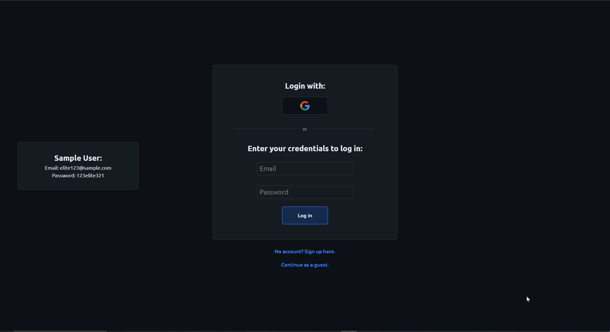

# Blogging Platform

> A full-stack blogging platform where users can create, edit, and manage rich-text posts — built with React, Node.js, and TypeScript end-to-end.

🔗 **[Live Demo](https://blogging-platform-pearl-six.vercel.app/)**



---

## Features

- 📝 **Rich text editor** powered by Lexical — supports headings, quotes, bold/italic/underline, text alignment, and image embeds
- 🔐 **Authentication** via credentials or Google OAuth 2.0
- 🖼️ **Image uploads** stored on AWS S3
- 📊 **User dashboard** to manage, edit, and delete your own posts
- 🌗 **Dark/light mode** toggle with persistent theme
- 📱 **Responsive design** with a collapsible mobile nav
- ⚡ **Optimistic UI** with RTK Query for fast, seamless data fetching

---

## Tech Stack

### Frontend
| Technology | Purpose |
|---|---|
| React 19 + TypeScript | UI framework |
| Redux Toolkit + RTK Query | Global state & data fetching |
| Redux Persist | Persisted auth state |
| Lexical | Rich text editor |
| Framer Motion | Animations |
| React Router v7 | Client-side routing |
| CSS Modules | Scoped styling |
| Vite | Build tool |

### Backend
| Technology | Purpose |
|---|---|
| Node.js + Express + TypeScript | REST API |
| PostgreSQL + Sequelize ORM | Database |
| AWS S3 | Image storage |
| Google OAuth 2.0 | Social login |
| JWT + bcryptjs | Auth & password hashing |
| Multer | File upload handling |
| Helmet + express-rate-limit | Security |
| Miget | Backend hosting |

---

## Getting Started

### Prerequisites
- Node.js 18+
- PostgreSQL database
- AWS S3 bucket
- Google OAuth credentials

### Installation

```bash
# Clone the repo
git clone https://github.com/yaisnw/blogging-platform.git

# Install frontend dependencies
cd frontend
npm install

# Install backend dependencies
cd ../backend
npm install
```

### Environment Variables

Create a `.env.development` file in the `/frontend` directory:

```env
VITE_BASE_URL=
VITE_REDIRECT_URL=
VITE_GOOGLE_CLIENT_ID=
```

Create a `.env` file in the `/backend` directory:

```env
JWT_SECRET=
DEFAULT_AVATAR=
FRONTEND_URL=
DB_NAME=
DB_USER=
DB_PASSWORD=
DB_HOST=
DB_PORT=
GOOGLE_CLIENT_ID=
GOOGLE_CLIENT_SECRET=
AWS_REGION=
AWS_BUCKET_NAME=
AWS_ACCESS_KEY_ID=
AWS_SECRET_ACCESS_KEY=
```

### Running Locally

```bash
# Start the backend (with hot reload)
cd backend
npm run dev

# Start the frontend
cd frontend
npm run dev
```

### Building for Production

```bash
# Build frontend
cd frontend
npm run build

# Build backend
cd ../backend
npm run build
npm start
```

---

## Sample Account

Don't want to sign up? Use the sample credentials on the login page to explore the app.

---

## Deployment

- **Frontend** — deployed on [Vercel](https://vercel.com), auto-deploys on push to `main`
- **Backend** — hosted on [Miget](https://miget.com)
- **Database** — PostgreSQL on Miget
- **Images** — stored on AWS S3
